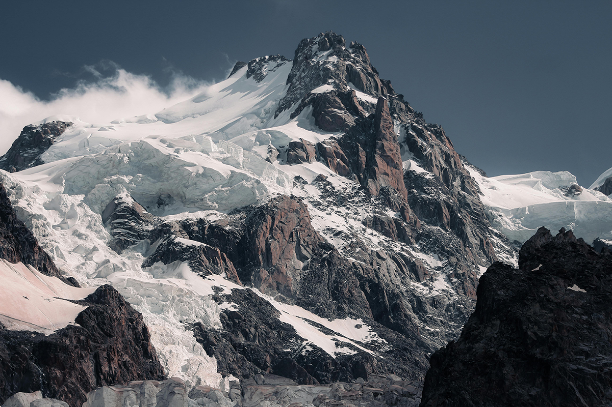

# Curved Pixel Sorting via Simple Equations and Vector Fields

Base Image           |  Our Result
:-------------------------:|:-------------------------:
|  |  |

Term project for [CMPT461: Computational Photography and Image Manipulation](https://yaksoy.github.io/cpim/)

[Video Presentation](https://youtu.be/xdps2UoWjYk)

While most pixel sorters solve for the problem of sorted straight lines across the image, the domain of curved and other non-straight lines is not well defined. This project is an investigation into one particular way of pixelsorting an image using defined equations for dx and dy, or through per-pixel vector fields.

This is delivered using a DearPyGUI interface that allows the user to load in an image, adjust masking settings, define their pixel line transformations, and finally sort[^1] an image. 

[^1]: Note that the current implementation uses a linear min to max gradient on each pixel line, therefore the current results aren't technically pixel sorting.

## Installation

Download an executable from [releases](https://github.com/rolandium/pixelsort/releases). Or if you'd prefer to run to code yourself...

## Manual Installation

To handle dependancies, install [poetry](https://python-poetry.org/docs/), download the source code, navigate to the root folder of this project, and enter the command:

```
poetry install
```

This will handle the installation of all packages used in this project.

To run the interactive pixel sorter, navigate to the root folder of this project and enter the command:

```
poetry run python ./src/pixelsort/main.py
```

or if you're using Windows:
```
poetry run python .\src\pixelsort\main.py
```

## Building Executable

On Linux, the build script can be ran with 

```
bash ./pyinstall.sh
```

On Windows, follow the instructions in the comments of ``pyinstall.sh``

## Usage

General usage steps are as follows:

1. On initial startup, follow the prompt to generate the vector fields used in image transformations.
2. Load an image using the top bar: ``File > Open File``
3. Define your mask parameters via the masking selection in the operations drop-down menu on the right sidebar.
    - Once your parameters are finalized, create the mask using the `Create Mask` button.
4. Navigate to the `Transformations` menu via the operations drop-down, and choose your transformation method. 
    - If using cardinal directions, choose one using the direction select drop down menu.
    - If using a defined angle in degrees, select `Custom` in the direction select drop down and define your angle in the `Custom Input in Degrees` text field.
    - If using custom equations for dX and dY, select `None` in the direction select drop down and define dX and dY in terms of t.
        - dX and dY are the rates of change in terms of t. For example, to have a simple diagonal line to the bottom right, dX = dY = 1. 
        - More complex operations can be defined using simple mathematical operations, such as addition or subtraction. 
        - t increments over time, so on frame 0, t=0, and on frame 10, t=10. Keep this in mind when constucting your dX and dY equations.
    - If using a vector field to transform the pixels, select a pre-made vector field from the drop down menu, and tick the `Apply vector field` box.
        - Note that these will not work if the vector fields have not been generated already on the `---` page.
5. In the `Transformations` menu, choose your color warping method (currently only one option exists), and the number of frames to render.
    - The number of frames to render defines the maximum number of steps that t will take. As a result, the number of frames = the maximum sorted line length.
6. Apply transformations and begin rendering the image using the `Apply Transformations` button.
7. When the rendering is complete, view the completed frames on the `Frame Selector` menu via the operations drop-down.
    - The output as well as all of the output frames can be saved via `File > Save <x>` or via the save buttons located in the `Transformations` and `Frame Select` menus.

## Examples

Base Image           |  Output Image
:-------------------------:|:-------------------------:
| Carina Nebula | Vector Field: Explosion, 30 Frames| 
|  |  |
| Andromeda Galaxy | Direction: Left, 30 Frames |
|  | |
| Mount Everest | Vector Field: Orbit, 30 Frames |
|  |  |

## Known Issues

- Current implementation is unoptimized and runs very slowly.
    - Because the initial vector field generation can take a long while, especially on weaker systems, do not panic if the progress bar seems stuck.
    - To avoid having a ten hour rendering step, consider downscaling your images before using them in the program.
- When resizing the window on Windows, DearPyGUI can sometimes not detect the size change, causing the GUI to become inactive.
    - A workaround is to resize the window again and seeing if the GUI is interactable.
- On Windows, the window icon in the upper left does not appear when running a compiled executable.